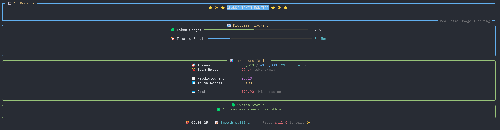

# 🎯 Claude Code Usage Monitor

[](https://pypi.org/project/ccusage-monitor/)
[](https://pypi.org/project/ccusage-monitor/)
[](https://opensource.org/licenses/MIT)
[](https://github.com/zhiyue/ccusage-monitor/actions/workflows/test.yml)
[](https://github.com/zhiyue/ccusage-monitor/actions/workflows/publish-test.yml)
[](https://github.com/zhiyue/ccusage-monitor/actions/workflows/publish-release.yml)
[](https://codecov.io/gh/zhiyue/ccusage-monitor)
[](https://pypi.org/project/ccusage-monitor/)
[](https://github.com/psf/black)
[](https://pycqa.github.io/isort/)
[](https://github.com/astral-sh/ruff)
[](http://makeapullrequest.com)
[](https://github.com/zhiyue/ccusage-monitor/stargazers)

Real-time terminal monitoring tool for Claude AI token usage. Track consumption, burn rate, and predict when tokens will run out.



## ✨ Features

- 🔄 **Real-time monitoring** - Updates every 3 seconds
- 📊 **Visual progress bars** - Token and time usage at a glance
- 🔮 **Smart predictions** - Know when tokens will deplete
- 🤖 **Auto-detection** - Automatically detects your token limits
- 📋 **Multiple plans** - Supports Pro, Max5, Max20
- ⚠️ **Smart warnings** - Alerts before token depletion
- 🎨 **Rich UI mode** - Beautiful, flicker-free terminal interface (NEW!)

## 🚀 Quick Start

```bash
# Install from PyPI
pip install ccusage-monitor

# Install ccusage CLI tool (required)
npm install -g ccusage

# Run the monitor
ccusage-monitor
```

Or use without installation:
```bash
uvx ccusage-monitor
```

## 📖 Basic Usage

```bash
# Default (Pro plan)
ccusage-monitor

# Specify plan
ccusage-monitor --plan max5
ccusage-monitor --plan max20
ccusage-monitor --plan custom_max  # Auto-detect

# Custom timezone
ccusage-monitor --timezone US/Eastern

# Custom reset hour
ccusage-monitor --reset-hour 9

# Beautiful Rich UI mode (recommended!)
ccusage-monitor --rich
```

## 📚 Documentation

- [Installation Guide](docs/INSTALL.md) - Detailed installation instructions
- [Usage Guide](docs/USAGE.md) - Complete usage documentation
- [Configuration](docs/CONFIG.md) - All configuration options
- [Troubleshooting](TROUBLESHOOTING.md) - Common issues and solutions
- [Contributing](CONTRIBUTING.md) - How to contribute
- [Changelog](CHANGELOG.md) - Version history

## 🤝 Contributing

Contributions are welcome! See [CONTRIBUTING.md](CONTRIBUTING.md) for guidelines.

## 📝 License

MIT License - see [LICENSE](LICENSE) file.

## 🙏 Acknowledgments

Built upon [ccusage](https://github.com/ryoppippi/ccusage) by [@ryoppippi](https://github.com/ryoppippi).

---

<div align="center">

⭐ **Star this repo if you find it useful!** ⭐

[Report Bug](https://github.com/zhiyue/ccusage-monitor/issues) • [Request Feature](https://github.com/zhiyue/ccusage-monitor/issues)

</div>