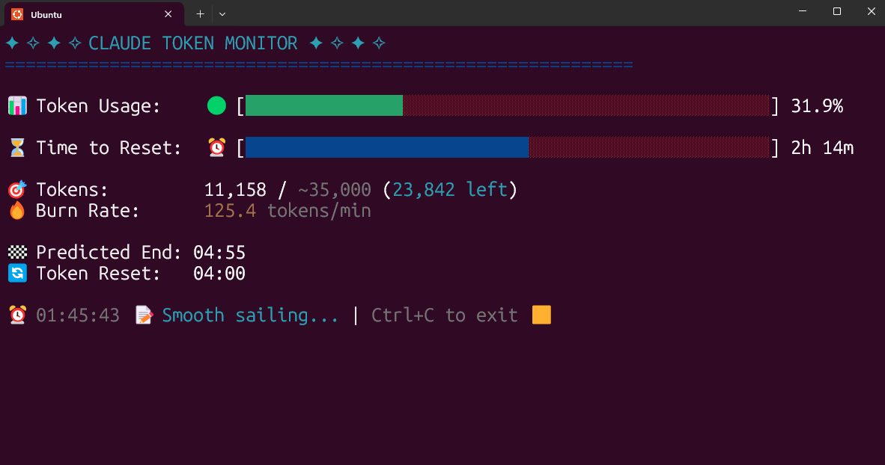

# 🎯 Claude Code Usage Monitor

[](https://python.org)
[](https://opensource.org/licenses/MIT)
[](http://makeapullrequest.com)

A beautiful real-time terminal monitoring tool for Claude AI token usage. Track your token consumption, burn rate, and get predictions about when you'll run out of tokens.



---

## 📑 Table of Contents

- [✨ Features](#-features)
- [🚀 Installation](#-installation)
  - [Prerequisites](#prerequisites)
  - [Quick Setup](#quick-setup)
- [📖 Usage](#-usage)
  - [Basic Usage](#basic-usage)
  - [Specify Your Plan](#specify-your-plan)
  - [Custom Reset Times](#custom-reset-times)
  - [Timezone Configuration](#timezone-configuration)
  - [Exit the Monitor](#exit-the-monitor)
- [📊 Understanding Claude Sessions](#-understanding-claude-sessions)
  - [How Sessions Work](#how-sessions-work)
  - [Token Reset Schedule](#token-reset-schedule)
  - [Burn Rate Calculation](#burn-rate-calculation)
- [🛠️ Token Limits by Plan](#-token-limits-by-plan)
- [🔧 Advanced Features](#-advanced-features)
  - [Auto-Detection Mode](#auto-detection-mode)
  - [Smart Pro Plan Switching](#smart-pro-plan-switching)
- [⚡ Best Practices](#-best-practices)
- [🐛 Troubleshooting](#-troubleshooting)
- [🚀 Example Usage Scenarios](#-example-usage-scenarios)
- [🤝 Contributing](#-contributing)
- [📝 License](#-license)
- [🙏 Acknowledgments](#-acknowledgments)

---

## ✨ Features

- **🔄 Real-time monitoring** - Updates every 3 seconds with smooth refresh
- **📊 Visual progress bars** - Beautiful color-coded token and time progress bars
- **🔮 Smart predictions** - Calculates when tokens will run out based on current burn rate
- **🤖 Auto-detection** - Automatically switches to custom max when Pro limit is exceeded
- **📋 Multiple plan support** - Works with Pro, Max5, Max20, and auto-detect plans
- **⚠️ Warning system** - Alerts when tokens exceed limits or will deplete before session reset
- **💼 Professional UI** - Clean, colorful terminal interface with emojis
- **✨ No screen flicker** - Smooth updates without clearing the entire screen
- **⏰ Customizable reset times** - Set your own token reset schedule

---

## 🚀 Installation

### Prerequisites

1. **Python 3.6+** installed on your system
2. **pytz** Python package:
   ```bash
   pip install pytz
   ```
3. **ccusage** CLI tool installed globally:
   ```bash
   npm install -g ccusage
   ```

### Quick Setup

```bash
# Clone the repository
git clone https://github.com/Maciek-roboblog/Claude-Code-Usage-Monitor.git
cd Claude-Code-Usage-Monitor

# Make the script executable
chmod +x ccusage_monitor.py

# Run the monitor
./ccusage_monitor.py
```

---

## 📖 Usage

### Basic Usage

Run with default settings (Pro plan - 7,000 tokens):

```bash
./ccusage_monitor.py
```

> **💡 Smart Detection**: When tokens exceed the Pro limit, the monitor automatically switches to custom_max mode and displays a notification.

### Specify Your Plan

```bash
# Pro plan (~7,000 tokens) - Default
./ccusage_monitor.py --plan pro

# Max5 plan (~35,000 tokens)
./ccusage_monitor.py --plan max5

# Max20 plan (~140,000 tokens)
./ccusage_monitor.py --plan max20

# Auto-detect from highest previous session
./ccusage_monitor.py --plan custom_max
```

### Custom Reset Times

Set a custom daily reset hour (0-23):

```bash
# Reset at 3 AM
./ccusage_monitor.py --reset-hour 3

# Reset at 10 PM
./ccusage_monitor.py --reset-hour 22
```

### Timezone Configuration

The default timezone is **Europe/Warsaw**. You can change it to any valid timezone:

```bash
# Use US Eastern Time
./ccusage_monitor.py --timezone US/Eastern

# Use Tokyo time
./ccusage_monitor.py --timezone Asia/Tokyo

# Use UTC
./ccusage_monitor.py --timezone UTC

# Use London time
./ccusage_monitor.py --timezone Europe/London
```

### Exit the Monitor

Press `Ctrl+C` to gracefully exit the monitoring tool.

---

## 📊 Understanding Claude Sessions

### How Sessions Work

Claude Code operates on a **5-hour rolling session window system**:

- **Sessions start** with your first message to Claude
- **Sessions last** for exactly 5 hours from that first message
- **Token limits** apply within each 5-hour session window
- **Multiple sessions** can be active simultaneously

### Token Reset Schedule

**Default reset times** (in your configured timezone, default: Europe/Warsaw):
- `04:00`, `09:00`, `14:00`, `18:00`, `23:00`

> **⚠️ Important**: These are reference times. Your actual token refresh happens 5 hours after YOUR first message in each session.

> **🌍 Timezone Note**: The default timezone is Europe/Warsaw. You can change it using the `--timezone` parameter with any valid timezone name.

### Burn Rate Calculation

The monitor calculates burn rate based on all sessions from the last hour:

- Analyzes token consumption across overlapping sessions
- Provides accurate recent usage patterns
- Updates predictions in real-time

---

## 🛠️ Token Limits by Plan

| Plan | Token Limit | Best For |
|------|-------------|----------|
| **Pro** | ~7,000 | Light usage, testing (default) |
| **Max5** | ~35,000 | Regular development |
| **Max20** | ~140,000 | Heavy usage, large projects |
| **Custom Max** | Auto-detect | Automatically uses highest from previous sessions |

---

## 🔧 Advanced Features

### Auto-Detection Mode

When using `--plan custom_max`, the monitor:

1. 🔍 Scans all previous session blocks
2. 📈 Finds the highest token count used
3. ⚙️ Sets that as your limit automatically
4. ✅ Perfect for users with varying token limits

### Smart Pro Plan Switching

When using the default Pro plan:

- 🔍 Monitor detects when usage exceeds 7,000 tokens
- 🔄 Automatically switches to custom_max mode
- 📢 Shows notification of the switch
- ▶️ Continues monitoring with the new limit

---

## ⚡ Best Practices

1. **🚀 Start Early**: Begin monitoring when you start a new session
2. **👀 Watch Velocity**: Monitor burn rate indicators to manage usage
3. **📅 Plan Ahead**: If tokens will deplete before reset, adjust your usage
4. **⏰ Custom Schedule**: Set `--reset-hour` to match your typical work schedule
5. **🤖 Use Auto-Detect**: Let the monitor figure out your limits with `--plan custom_max`

---

## 🐛 Troubleshooting

### "Failed to get usage data"

- Ensure `ccusage` is installed: `npm install -g ccusage`
- Check if you have an active Claude session
- Verify `ccusage` works: `ccusage blocks --json`

### "No active session found"

- Start a new Claude Code session
- The monitor only works when there's an active session

### Cursor remains hidden after exit

```bash
printf '\033[?25h'
```

### Display issues or overlapping text

- Ensure your terminal window is at least 80 characters wide
- Try resizing your terminal and restarting the monitor

---

## 🚀 Example Usage Scenarios

### Morning Developer
```bash
# Start work at 9 AM daily
./ccusage_monitor.py --reset-hour 9
```

### Night Owl Coder
```bash
# Often work past midnight
./ccusage_monitor.py --reset-hour 0
```

### Heavy User with Variable Limits
```bash
# Let the monitor figure out your limits
./ccusage_monitor.py --plan custom_max
```

### Quick Check with Default Settings
```bash
# Just run it!
./ccusage_monitor.py
```

### International User
```bash
# Use your local timezone
./ccusage_monitor.py --timezone America/New_York
./ccusage_monitor.py --timezone Asia/Singapore
./ccusage_monitor.py --timezone Australia/Sydney
```

---

## 🤝 Contributing

Contributions are welcome! Feel free to:

- 🐛 Report bugs or issues
- 💡 Suggest new features
- 🔧 Submit pull requests
- 📚 Improve documentation

### 📊 Help Us Improve Token Limit Detection

We're collecting data about actual token limits to improve the auto-detection feature. If you're using Claude and your tokens exceeded the standard limits, please share your experience in [Issue #1](https://github.com/Maciek-roboblog/Claude-Code-Usage-Monitor/issues/1):

**What to share:**
- Your subscription type (Pro, Teams, Enterprise)
- The maximum tokens you reached (custom_max value)
- When the limit was exceeded
- Any patterns you've noticed

This data helps us better understand token allocation across different subscription tiers and improve the monitoring tool for everyone.

---

## 📝 License

[MIT License](LICENSE) - feel free to use and modify as needed.

---

## 🙏 Acknowledgments

This tool builds upon the excellent [ccusage](https://github.com/ryoppippi/ccusage) by [@ryoppippi](https://github.com/ryoppippi), adding a real-time monitoring interface with visual progress bars, burn rate calculations, and predictive analytics.

- 🏗️ Built for monitoring [Claude Code](https://claude.ai/code) token usage
- 🔧 Uses [ccusage](https://www.npmjs.com/package/ccusage) for data retrieval
- 💭 Inspired by the need for better token usage visibility

---

<div align="center">

**⭐ Star this repo if you find it useful! ⭐**

[Report Bug](https://github.com/Maciek-roboblog/Claude-Code-Usage-Monitor/issues) • [Request Feature](https://github.com/Maciek-roboblog/Claude-Code-Usage-Monitor/issues) • [Contribute](https://github.com/Maciek-roboblog/Claude-Code-Usage-Monitor/pulls)

</div>
