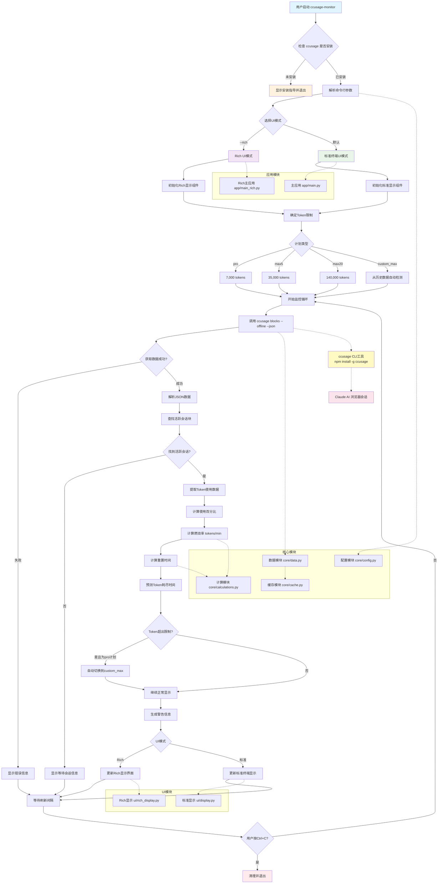

# 🔄 Claude Code Usage Monitor - 项目流程图

## 📊 系统流程图

以下是Claude Code Usage Monitor的完整系统流程图，展示了从启动到运行的整个过程：



## 🔍 流程详解

### 1. 启动阶段
- **依赖检查**: 验证ccusage CLI工具是否已安装
- **参数解析**: 处理命令行参数和配置选项
- **UI选择**: 根据`--rich`参数选择界面模式

### 2. 初始化阶段
- **组件初始化**: 根据UI模式初始化相应的显示组件
- **限制确定**: 根据计划类型设置token限制
- **缓存准备**: 初始化数据缓存系统

### 3. 监控循环
- **数据获取**: 调用ccusage CLI获取最新使用数据
- **数据处理**: 解析JSON并提取关键信息
- **计算分析**: 计算使用率、燃烧率和预测时间
- **显示更新**: 更新用户界面显示

### 4. 智能调整
- **自动切换**: Pro计划超限时自动切换到custom_max
- **警告生成**: 根据使用情况生成相应警告
- **时间预测**: 基于燃烧率预测token耗尽时间

## 📋 关键决策点

### UI模式选择
```
用户参数 --rich
├── 是 → Rich UI (美观界面)
└── 否 → 标准UI (兼容性好)
```

### 计划类型处理
```
计划参数
├── pro → 7,000 tokens
├── max5 → 35,000 tokens
├── max20 → 140,000 tokens
└── custom_max → 自动检测历史最高值
```

### 错误处理流程
```
ccusage调用
├── 成功 → 继续处理
├── 失败 → 显示错误信息
├── 超时 → 重试机制
└── 未安装 → 安装指导
```

## 🔄 数据流向

### 输入数据流
1. **用户输入** → 命令行参数
2. **ccusage CLI** → JSON格式的使用数据
3. **系统时间** → 时区和重置时间计算

### 处理数据流
1. **原始数据** → 解析和验证
2. **活跃会话** → 提取和分析
3. **历史数据** → 燃烧率计算
4. **预测算法** → 时间估算

### 输出数据流
1. **进度条** → 可视化使用情况
2. **统计信息** → 详细数据展示
3. **警告信息** → 状态提醒
4. **预测结果** → 时间预估

## ⚡ 性能优化点

### 缓存策略
- **数据缓存**: 5秒TTL减少CLI调用
- **计算缓存**: 避免重复计算
- **显示缓存**: 内容变化检测

### 异步处理
- **非阻塞UI**: 保持界面响应
- **超时控制**: 防止程序挂起
- **错误恢复**: 优雅处理异常

## 🎯 用户体验流程

### 正常使用流程
```
启动工具 → 查看实时数据 → 监控使用情况 → 接收警告 → 调整使用策略
```

### 错误处理流程
```
遇到错误 → 查看错误信息 → 按照指导操作 → 重新启动工具
```

### 配置调整流程
```
默认配置 → 发现需求 → 调整参数 → 重启应用 → 验证效果
```

## 📊 监控指标

### 核心指标
- **Token使用率**: 当前使用量/总限制
- **燃烧率**: tokens/分钟的消耗速度
- **剩余时间**: 基于当前速度的预测
- **重置时间**: 下次token重置的时间

### 状态指标
- **会话状态**: 活跃/等待/错误
- **连接状态**: 正常/超时/失败
- **计划状态**: 当前计划类型和限制

---

## 📚 相关文档

- [项目架构](ARCHITECTURE.md)
- [安装指南](INSTALL.md)
- [使用说明](USAGE.md)
- [配置选项](CONFIG.md)

---

*此流程图展示了Claude Code Usage Monitor的完整工作流程，帮助开发者和用户理解系统的运行机制。*
